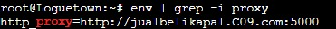

# Jaringan Komputer C-09 (2021)
Laporan Resmi Jaringan Komputer Modul 3 - DHCP dan Proxy

NRP              | Nama
-----------------|-----------
05111940000014   | Ega Prabu Pamungkas
05111940000178   | Muhammad Rizqullah Akbar
05111940000227   | Rayhan Daffa Alhafish

# Nomor 5
### Soal
*Client mendapatkan DNS dari EniesLobby dan client dapat terhubung dengan internet melalui DNS tersebut.*
### Jawaban
Untuk dapat melakukan koneksi melalui DNS dari EniesLobby dilakukan forwarding DNS ke nameserver yang didapat oleh Foosha, yaitu `192.188.122.1`. Forwarding DNS dilakukan dengan mengedit pada EniesLobby `/etc/bind/named.conf.options`
```
forwarders {
    192.168.122.1;
};

//dnssec-validation auto;
allow-query{any;};
```
Dapat dicek setiap node client apakah sudah terkoneksi dengan internet dengan melakukan ping ke *google.com*

Node Loguetown


Node Alabasta


Node Tottoland


Node Skypie


# Nomor 6
### Soal
*Lama waktu DHCP server meminjamkan alamat IP kepada Client yang melalui Switch1 selama 6 menit sedangkan pada client yang melalui Switch3 selama 12 menit. Dengan waktu maksimal yang dialokasikan untuk peminjaman alamat IP selama 120 menit.*
### Jawaban
Dapat mengatur *lease time* dari IP pada setiap node dengan mengatur konfigurasi `default-lease-time` dan `max-lease-time` dari setiap subnet pada DHCP Server di node Jipangu. Konfigurasi dilakukan di `/etc/dhcp/dhcpd.conf`
```
subnet 192.188.1.0 netmask 255.255.255.0 {
        range 192.188.1.20 192.188.1.99;
        range 192.188.1.150 192.188.1.169;
        option routers 192.188.1.1;
        option broadcast-address 192.188.1.255;
        option domain-name-servers 192.188.2.2;
        default-lease-time 360;
        max-lease-time 7200;
}

subnet 192.188.3.0 netmask 255.255.255.0 {
        range 192.188.3.30 192.188.3.50;
        option routers 192.188.3.1;
        option broadcast-address 192.188.3.255;
        option domain-name-servers 192.188.2.2;
        default-lease-time 360;
        max-lease-time 7200;
}
```
Konfigurasi pada `/etc/dhcp/dhcpd.conf`


# Nomor 7
### Soal
*Luffy dan Zoro berencana menjadikan Skypie sebagai server untuk jual beli kapal yang dimilikinya dengan alamat IP yang tetap dengan IP [prefix IP].3.69 *
### Jawaban
IP yang harus dimiliki Skypie adalah `192.188.3.69`, hal ini dapat dilakukan dengan mengkonfigurasi host Skypie pada konfigurasi DHCP Server sebagai berikut.
```
host Skypie {
    hardware ethernet f6:d1:da:40:ac:1c;
    fixed-address 192.188.3.69;
}
```
Hardware Ethernet dapat dilihat dari node Skypie dengan mengetik `ip a` lalu melihat pada bagian `link/ether` pada `eth0`. Fixed address adalah address yang diinginkan.


# Nomor 8
### Soal
*Pada Loguetown, proxy harus bisa diakses dengan nama jualbelikapal.yyy.com dengan port yang digunakan adalah 5000.*
### Jawaban
Pertama, dengan membuat domain *jualbelikapal.C09.com* pada DNS Server EniesLobby. Zone dikonfigurasikan pada `/etc/bind/named.conf.local`
```
zone "jualbelikapal.C09.com"{
        type master;
        file "/etc/bind/jarkom/jualbelikapal.C09.com";
};
```
Selanjutnya dikonfigurasikan filenya pada `/etc/bind/jarkom/jualbelikapal.C09.com` dan jangan lupa membuat folder dengan nama jarkom menggunakan `mkdir /etc/bind/jarkom`.

```
;
; BIND data file for local loopback interface
;
$TTL    604800
@       IN      SOA     jualbelikapal.C09.com. root.jualbelikapal.C09.com. (
                              2         ; Serial
                         604800         ; Refresh
                          86400         ; Retry
                        2419200         ; Expire
                         604800 )       ; Negative Cache TTL
;
@       IN      NS      jualbelikapal.C09.com.
@       IN      A       192.188.2.3 ; IP Water7
www     IN      CNAME   jualbelikapal.C09.com.
```
Setelah domain dibuat, atur agar proxy (pada node Water7) yang digunakan menggunakan port 5000. Konfigurasikan pada `/etc/squid/squid.conf` dengan `http_port 5000` dan visible hostname menjadi nama domain yang digunakan.
```
http_port 5000
visible_hostname jualbelikapal.C09.com
```
Setelah semua dikonfigurasikan maka pada node client dapat menggunakan proxy dengan `export http_proxy="http://jualbelikapal.C09.com:5000"`. Lalu dapat dicek apakah sudah menggunakan proxy dengan `env | grep -i proxy`.



Mengetes proxy yang digunakan akan forbidden karena konfigurasi di nomor selanjutnya dimana hanya dapat diakses pada waktu tertentu.


# Nomor 9
### Soal
*Agar transaksi jual beli lebih aman dan pengguna website ada dua orang, proxy dipasang autentikasi user proxy dengan enkripsi MD5 dengan dua username, yaitu luffybelikapalyyy dengan password luffy_yyy dan zorobelikapalyyy dengan password zoro_yyy.*
### Jawaban
Pertama pada node Water7 atau Proxy Server, dapat menginstall `apache2-utils` dengan menjalankan `apt-get update` lalu `apt-get install apache2-utils`. Setelah itu dapat menjalankan 2 command berikut.
```
htpasswd -cbm /etc/squid/passwords luffybelikapalC09 luffy_C09
```
Command diatas akan menambahkan user dimana Opsi `-c` untuk membuat file baru dimana username dan password disimpan, opsi `-b` digunakan untuk mendefinisikan password pada command line, dan opsi `-m` untuk menggunakan enkripsi MD5. Tambahkan juga untuk username kedua, namun tanpa opsi `-c` karena file sudah ada.
```
htpasswd -bm /etc/squid/passwords zorobelikapalC09 zoro_C09
```
Terkahir dapat melakukan test dengan mencoba mengakses webiste *its.ac.id*


# Nomor 10
### Soal
*Transaksi jual beli tidak dilakukan setiap hari, oleh karena itu akses internet dibatasi hanya dapat diakses setiap hari Senin-Kamis pukul 07.00-11.00 dan setiap hari Selasa-Jum’at pukul 17.00-03.00 keesokan harinya (sampai Sabtu pukul 03.00) (10).*

### Jawaban
Untuk membatasi akses pada waktu-waktu yang ditentukan maka diperlukan konfigurasi dengan membuat file */etc/squid/restricted-times.conf* dan di*include* ke dalam file */etc/squid/squid.conf*.

Pada file *restricted-times.conf* diisi dengan membuat
```
acl monday_thursday time MTWH 07:00-11:00
acl tuesday_friday time TWHF 17:00-23:59
acl wednesday_saturday time WHFA 00:00-03:00
```

dan pada file *squid.conf* diisi dengan
```
http_access allow monday_thursday USERS
http_access allow tuesday_friday USERS
http_access allow wednesday_saturday USERS
http_access deny
```
Dengan ini pembatasan akses disesuaikan dengan waktu yang diminta.


# Nomor 11
### Soal
*Agar transaksi bisa lebih fokus berjalan, maka dilakukan redirect website agar mudah mengingat website transaksi jual beli kapal. Setiap mengakses google.com, akan diredirect menuju super.franky.yyy.com dengan website yang sama pada soal shift modul 2. Web server super.franky.yyy.com berada pada node Skypie (11).*

### Jawaban
Untuk melakukan redirect website google.com ke super.franky.C09.com, maka dilakukan tambahan konfigurasi pada *proxy server* water7 pada file */etc/squid/squid.conf* dengan barisan kode berikut.
```
acl google dstdomain .google.com
http_access deny google
deny_info http://super.franky.C09.com google
```


# Nomor 12
### Soal
*Saatnya berlayar! Luffy dan Zoro akhirnya memutuskan untuk berlayar untuk mencari harta karun di super.franky.yyy.com. Tugas pencarian dibagi menjadi dua misi, Luffy bertugas untuk mendapatkan gambar (.png, .jpg), sedangkan Zoro mendapatkan sisanya. Karena Luffy orangnya sangat teliti untuk mencari harta karun, ketika ia berhasil mendapatkan gambar, ia mendapatkan gambar dan melihatnya dengan kecepatan 10 kbps (12).*

### Jawaban
Untuk membatasi bandwith pada user Luffy maka dilakukan penambahan konfigurasi. Konfigurasi bisa dilakukan pada file */etc/squid/squid.conf* langsung atau menambahkan file baru dan di-*include* kedalam */etc/squid/squid.conf*. Untuk bisa mengidentifikasi user luffy maka digunakan `proxy_auth` dengan ini kita bisa mengetahui user yang melakukan login melalui proxy. untuk kode secara keseluruhan sebagai berikut.
```
acl luffy proxy_auth luffybelikapalC09
delay_pools 2
delay_class 1 1
delay_parameters 1 1250/1250
delay_access 1 allow luffy
delay_access 1 deny all
```
Ditambahkan `delay_parameters 1 1250/1250` untuk membatasi bandwith menjadi 10kbps, dimana 10kbps = 1250 Byte per second.


# Nomor 13
### Soal
*Sedangkan, Zoro yang sangat bersemangat untuk mencari harta karun, sehingga kecepatan kapal Zoro tidak dibatasi ketika sudah mendapatkan harta yang diinginkannya (13).*
### Jawaban
Sama seperti konfigurasi *bandwith limit* user luffy, tapi tanpa `delay_parameters` karena bandwith tidak dibatasi. Tambahan konfigurasi dengan barisan kode berikut.
```
delay_class 2 1
delay_parameters 2 none
delay_access 2 allow !luffy
```
Dimana kode diatas bermaksud user selain luffy tidak akan dibatasi bandwithnya.


